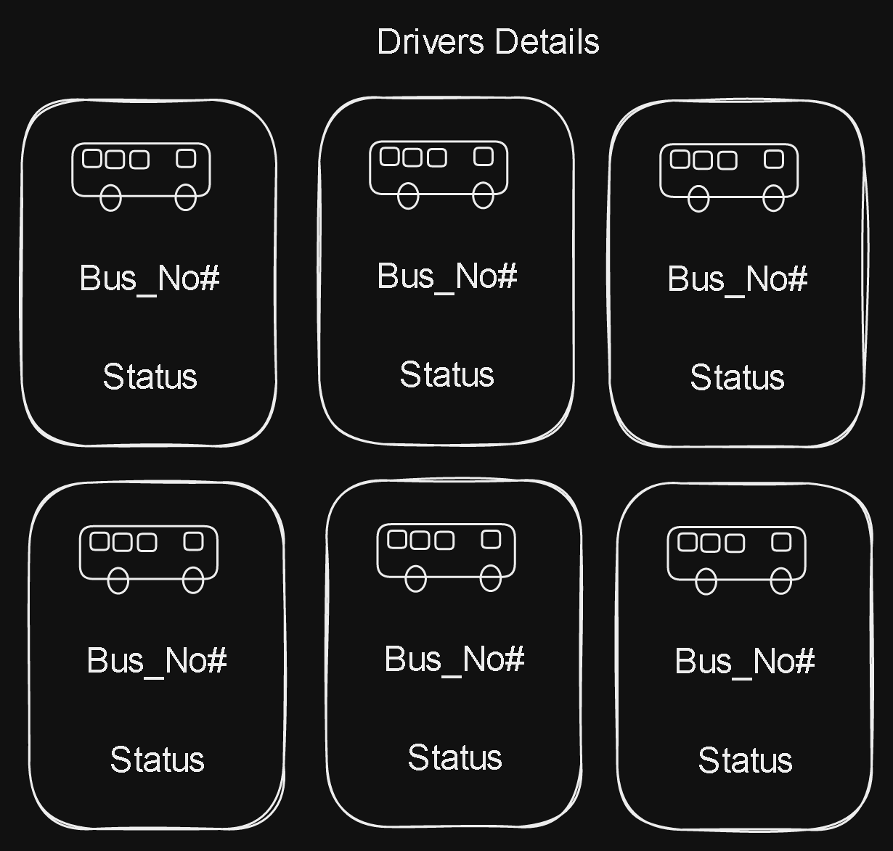

# Buses Details Tab

This two files will contain the code for The Buses Details Tab.

So according the way you have learnt, you have to add the HTML code in the return statement on the javascript function, and corresponding add the styles for the design.

Reference : <https://www.youtube.com/watch?v=NE2UgLd1-2k>

<https://www.youtube.com/watch?v=Ny7LkAt4btI>

<https://www.youtube.com/watch?v=RGKi6LSPDLU>
